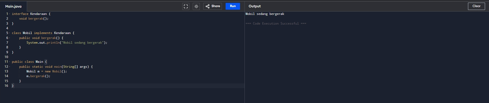
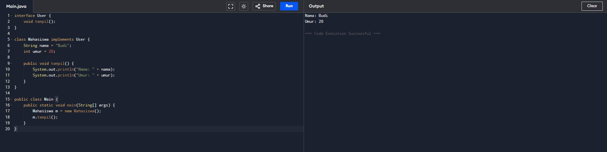
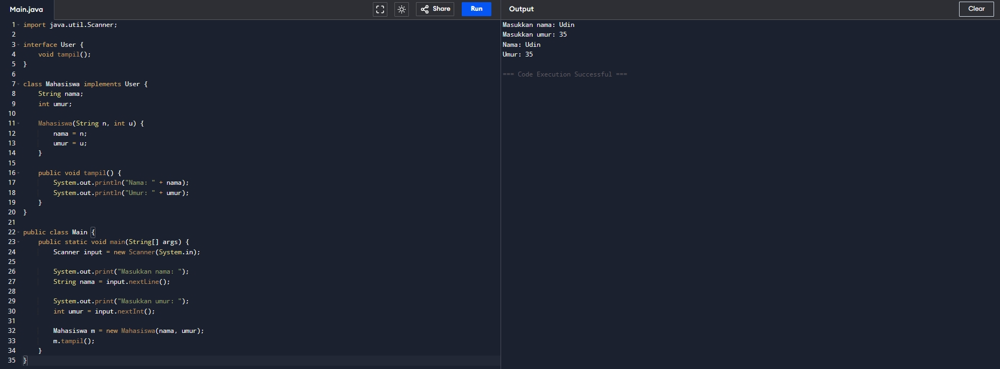
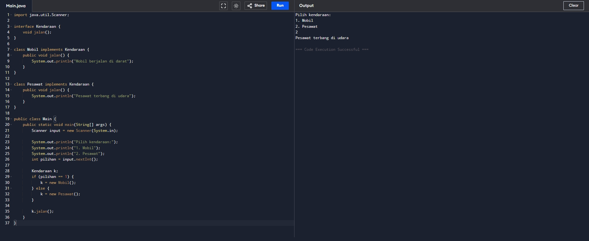
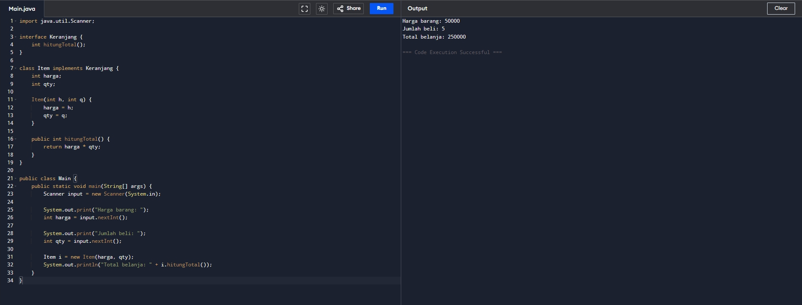
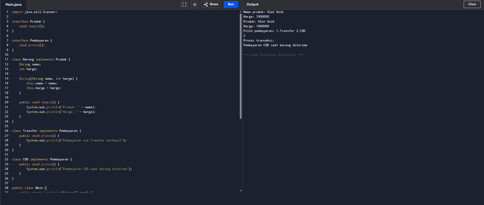

# Tugas Pemrograman Berorientasi Objek

| | |
| :--- | :--- |
| **Kode Kelas** | SI403 |
| **Dosen Pengajar** | Dr. Fauziah , S.Kom., M.M.S.I. |
| **Universitas** | Universitas Siber Asia |
| **Nama Mahasiswa** | Angga Alfiansah |
| **NIM** | 240101010032 |


---
# Analisis Kode Program Java - Latihan Sesi 10 (Interface & Polimorfisme)

Dokumen ini berisi analisis baris demi baris serta penjelasan maksud dan tujuan untuk contoh kode Java mengenai konsep Interface dan Polimorfisme (Polymorphism).

---

## Latihan 1: Implementasi Interface Dasar

### Kode Sumber
```java
interface Kendaraan {
    void bergerak();
}

class Mobil implements Kendaraan {
    public void bergerak() {
        System.out.println("Mobil sedang bergerak");
    }
}

public class Main {
    public static void main(String[] args) {
        Mobil m = new Mobil();
        m.bergerak();
    }
}
```

### Maksud dan Tujuan Kode
* **Maksud**: Kode ini mendefinisikan sebuah antarmuka (*interface*) bernama `Kendaraan` dengan satu kontrak perilaku yaitu metode `bergerak()`. Kelas konkret `Mobil` kemudian mengimplementasikan interface tersebut dengan menyediakan kode pelaksanaan untuk metode tersebut.
* **Tujuan**: Memisahkan definisi kontrak perilaku (*what to do*) dengan detail implementasi konkret (*how to do*). Ini memastikan bahwa setiap objek bertipe `Kendaraan` di masa depan dijamin memiliki kemampuan untuk `bergerak`, meskipun cara bergeraknya berbeda-beda (misalnya `Mobil` berjalan, `Perahu` berlayar).

### Analisa Per Baris
* **Baris 1**: `interface Kendaraan {` — Mendeklarasikan sebuah interface baru dengan nama `Kendaraan`.
* **Baris 2**: `void bergerak();` — Mendeklarasikan metode abstrak `bergerak()` tanpa body/implementasi. Metode ini secara implisit bertipe `public` dan `abstract`.
* **Baris 3**: `}` — Penutup deklarasi interface `Kendaraan`.
* **Baris 5**: `class Mobil implements Kendaraan {` — Mendeklarasikan kelas bernama `Mobil` yang mengimplementasikan (memenuhi kontrak) interface `Kendaraan`.
* **Baris 6**: `public void bergerak() {` — Meng-override metode `bergerak()`. Implementasi metode dari interface wajib menggunakan kata kunci `public`.
* **Baris 7**: `System.out.println("Mobil sedang bergerak");` — Perintah keluaran untuk mencetak tulisan `"Mobil sedang bergerak"` ke layar konsol.
* **Baris 8**: `}` — Penutup blok metode `bergerak()`.
* **Baris 9**: `}` — Penutup deklarasi kelas `Mobil`.
* **Baris 11**: `public class Main {` — Mendeklarasikan kelas utama publik bernama `Main`.
* **Baris 12**: `public static void main(String[] args) {` — Titik masuk (entry point) utama untuk mengeksekusi program Java.
* **Baris 13**: `Mobil m = new Mobil();` — Membuat instansi objek baru dari kelas `Mobil` dan menyimpannya di variabel referensi `m`.
* **Baris 14**: `m.bergerak();` — Memanggil metode `bergerak()` pada objek `m`.
* **Baris 15**: `}` — Penutup blok metode `main`.
* **Baris 16**: `}` — Penutup kelas `Main`.

### Hasil Menjalankan Program (Screenshot)




---

## Latihan 2: Kelas Mahasiswa dengan Atribut Statis

### Kode Sumber
```java
interface User {
    void tampil();
}

class Mahasiswa implements User {
    String nama = "Budi";
    int umur = 20;

    public void tampil() {
        System.out.println("Nama: " + nama);
        System.out.println("Umur: " + umur);
    }
}

public class Main {
    public static void main(String[] args) {
        Mahasiswa m = new Mahasiswa();
        m.tampil();
    }
}
```

### Maksud dan Tujuan Kode
* **Maksud**: Membuat interface `User` dengan kontrak `tampil()`, yang diimplementasikan oleh kelas `Mahasiswa` untuk menyajikan data profil pengguna (nama dan umur) secara langsung dengan nilai default.
* **Tujuan**: Menstandarkan cara menampilkan profil pengguna di dalam program. Siapa pun objek yang bertindak sebagai pengguna (baik `Mahasiswa`, `Dosen`, atau `Admin`) wajib mengimplementasikan interface `User` sehingga profil mereka dapat dipanggil seragam melalui metode `tampil()`.

### Analisa Per Baris
* **Baris 1**: `interface User {` — Mendeklarasikan interface baru bernama `User`.
* **Baris 2**: `void tampil();` — Mendeklarasikan metode abstrak bernama `tampil()`.
* **Baris 3**: `}` — Penutup deklarasi interface `User`.
* **Baris 5**: `class Mahasiswa implements User {` — Mendeklarasikan kelas `Mahasiswa` yang mengimplementasikan interface `User`.
* **Baris 6**: `String nama = "Budi";` — Mendeklarasikan variabel `nama` bertipe data `String` dan menginisialisasinya dengan nilai default `"Budi"`.
* **Baris 7**: `int umur = 20;` — Mendeklarasikan variabel `umur` bertipe data `int` dengan inisialisasi awal nilai `20`.
* **Baris 9**: `public void tampil() {` — Mengimplementasikan metode `tampil()` dari interface `User`.
* **Baris 10**: `System.out.println("Nama: " + nama);` — Menampilkan label nama diikuti nilai dari variabel objek `nama` ke konsol.
* **Baris 11**: `System.out.println("Umur: " + umur);` — Menampilkan label umur diikuti nilai dari variabel objek `umur` ke konsol.
* **Baris 12**: `}` — Penutup blok metode `tampil()`.
* **Baris 13**: `}` — Penutup kelas `Mahasiswa`.
* **Baris 15**: `public class Main {` — Mendeklarasikan kelas utama bernama `Main`.
* **Baris 16**: `public static void main(String[] args) {` — Titik masuk utama program Java.
* **Baris 17**: `Mahasiswa m = new Mahasiswa();` — Membuat instansi objek baru dari kelas `Mahasiswa` dengan variabel referensi `m`.
* **Baris 18**: `m.tampil();` — Menjalankan metode `tampil()` milik kelas `Mahasiswa` yang menampilkan informasi nama dan umur statis.
* **Baris 19**: `}` — Penutup metode `main`.
* **Baris 20**: `}` — Penutup kelas `Main`.

### Hasil Menjalankan Program (Screenshot)




---

## Latihan 3: Input Dinamis dengan Scanner

### Kode Sumber
```java
import java.util.Scanner;

interface User {
    void tampil();
}

class Mahasiswa implements User {
    String nama;
    int umur;

    Mahasiswa(String n, int u) {
        nama = n;
        umur = u;
    }

    public void tampil() {
        System.out.println("Nama: " + nama);
        System.out.println("Umur: " + umur);
    }
}

public class Main {
    public static void main(String[] args) {
        Scanner input = new Scanner(System.in);

        System.out.print("Masukkan nama: ");
        String nama = input.nextLine();

        System.out.print("Masukkan umur: ");
        int umur = input.nextInt();

        Mahasiswa m = new Mahasiswa(nama, umur);
        m.tampil();
    }
}
```

### Maksud dan Tujuan Kode
* **Maksud**: Merupakan pengembangan dari Latihan 2, di mana profil pengguna (`Mahasiswa`) diinisialisasi secara dinamis berdasarkan input interaktif pengguna melalui *stream* `Scanner` dari konsol sebelum datanya ditampilkan.
* **Tujuan**: Menunjukkan cara mengintegrasikan kontrak interface `User` dengan aliran objek yang dinamis (menggunakan konstruktor berparameter `Mahasiswa(String n, int u)` untuk menampung data masukan pengguna secara *realtime*).

### Analisa Per Baris
* **Baris 1**: `import java.util.Scanner;` — Mengimpor pustaka `Scanner` untuk memfasilitasi pembacaan input keyboard dari pengguna.
* **Baris 3**: `interface User {` — Mendeklarasikan interface bernama `User`.
* **Baris 4**: `void tampil();` — Mendeklarasikan metode abstrak `tampil()`.
* **Baris 5**: `}` — Penutup interface `User`.
* **Baris 7**: `class Mahasiswa implements User {` — Mendeklarasikan kelas `Mahasiswa` yang mengimplementasikan interface `User`.
* **Baris 8**: `String nama;` — Mendeklarasikan variabel instansi `nama` bertipe `String` (tanpa inisialisasi nilai langsung).
* **Baris 9**: `int umur;` — Mendeklarasikan variabel instansi `umur` bertipe `int`.
* **Baris 11**: `Mahasiswa(String n, int u) {` — Mendeklarasikan konstruktor kelas `Mahasiswa` yang menerima dua buah parameter (`n` bertipe `String` dan `u` bertipe `int`).
* **Baris 12**: `nama = n;` — Memasukkan nilai dari parameter `n` ke dalam variabel instansi `nama`.
* **Baris 13**: `umur = u;` — Memasukkan nilai dari parameter `u` ke dalam variabel instansi `umur`.
* **Baris 14**: `}` — Penutup blok konstruktor.
* **Baris 16**: `public void tampil() {` — Mengimplementasikan metode `tampil()`.
* **Baris 17**: `System.out.println("Nama: " + nama);` — Menampilkan nilai nama dinamis ke layar.
* **Baris 18**: `System.out.println("Umur: " + umur);` — Menampilkan nilai umur dinamis ke layar.
* **Baris 19**: `}` — Penutup metode `tampil`.
* **Baris 20**: `}` — Penutup kelas `Mahasiswa`.
* **Baris 22**: `public class Main {` — Mendeklarasikan kelas utama bernama `Main`.
* **Baris 23**: `public static void main(String[] args) {` — Titik masuk utama eksekusi program.
* **Baris 24**: `Scanner input = new Scanner(System.in);` — Membuat instansi objek pembaca masukan `Scanner` dengan mengalirkan sistem input standar (`System.in`).
* **Baris 26**: `System.out.print("Masukkan nama: ");` — Mencetak teks instruksi pengisian nama.
* **Baris 27**: `String nama = input.nextLine();` — Membaca baris teks input dari konsol dan menyimpannya ke dalam variabel lokal `nama`.
* **Baris 29**: `System.out.print("Masukkan umur: ");` — Mencetak teks instruksi pengisian umur.
* **Baris 30**: `int umur = input.nextInt();` — Membaca input angka bertipe integer dari konsol dan menyimpannya ke variabel lokal `umur`.
* **Baris 32**: `Mahasiswa m = new Mahasiswa(nama, umur);` — Membuat objek baru `Mahasiswa` dengan meneruskan variabel `nama` dan `umur` ke konstruktor berparameter.
* **Baris 33**: `m.tampil();` — Mengeksekusi metode `tampil()` pada objek `m` untuk menampilkan data.
* **Baris 34**: `}` — Penutup blok metode `main`.
* **Baris 35**: `}` — Penutup kelas `Main`.

### Hasil Menjalankan Program (Screenshot)




---

## Latihan 4: Polimorfisme Interface (Darat & Udara)

### Kode Sumber
```java
import java.util.Scanner;

interface Kendaraan {
    void jalan();
}

class Mobil implements Kendaraan {
    public void jalan() {
        System.out.println("Mobil berjalan di darat");
    }
}

class Pesawat implements Kendaraan {
    public void jalan() {
        System.out.println("Pesawat terbang di udara");
    }
}

public class Main {
    public static void main(String[] args) {
        Scanner input = new Scanner(System.in);

        System.out.println("Pilih kendaraan:");
        System.out.println("1. Mobil");
        System.out.println("2. Pesawat");
        int pilihan = input.nextInt();

        Kendaraan k;
        if (pilihan == 1) {
            k = new Mobil();
        } else {
            k = new Pesawat();
        }

        k.jalan();
    }
}
```

### Maksud dan Tujuan Kode
* **Maksud**: Mendemonstrasikan implementasi **Polimorfisme Runtime** menggunakan interface `Kendaraan` sebagai tipe referensi umum bagi objek `Mobil` dan `Pesawat`.
* **Tujuan**: Membuat program yang fleksibel dan modular. Referensi variabel `k` bertipe `Kendaraan` dapat menampung objek `Mobil` maupun `Pesawat` secara bergantian saat runtime. Ketika `k.jalan()` dipanggil, program secara otomatis menjalankan metode yang tepat tanpa perlu tahu tipe objek aslinya pada fase kompilasi.

### Analisa Per Baris
* **Baris 1**: `import java.util.Scanner;` — Mengimpor pustaka `Scanner`.
* **Baris 3**: `interface Kendaraan {` — Mendeklarasikan interface bernama `Kendaraan`.
* **Baris 4**: `void jalan();` — Deklarasi metode abstrak `jalan()` tanpa implementasi fisik.
* **Baris 5**: `}` — Penutup interface `Kendaraan`.
* **Baris 7**: `class Mobil implements Kendaraan {` — Mendeklarasikan kelas `Mobil` yang mengimplementasikan interface `Kendaraan`.
* **Baris 8**: `public void jalan() {` — Implementasi metode `jalan()` milik kelas `Mobil`.
* **Baris 9**: `System.out.println("Mobil berjalan di darat");` — Menampilkan output `"Mobil berjalan di darat"`.
* **Baris 10**: `}` — Penutup metode `jalan()` kelas `Mobil`.
* **Baris 11**: `}` — Penutup kelas `Mobil`.
* **Baris 13**: `class Pesawat implements Kendaraan {` — Mendeklarasikan kelas `Pesawat` yang mengimplementasikan interface `Kendaraan`.
* **Baris 14**: `public void jalan() {` — Implementasi metode `jalan()` milik kelas `Pesawat`.
* **Baris 15**: `System.out.println("Pesawat terbang di udara");` — Menampilkan output `"Pesawat terbang di udara"`.
* **Baris 16**: `}` — Penutup metode `jalan()` kelas `Pesawat`.
* **Baris 17**: `}` — Penutup kelas `Pesawat`.
* **Baris 19**: `public class Main {` — Mendeklarasikan kelas utama bernama `Main`.
* **Baris 20**: `public static void main(String[] args) {` — Titik masuk program utama Java.
* **Baris 21**: `Scanner input = new Scanner(System.in);` — Membuat objek Scanner untuk menangkap masukan pengguna.
* **Baris 23-25**: Menampilkan menu pilihan kendaraan dan menampung input integer masukan ke variabel lokal `pilihan`.
* **Baris 27**: `Kendaraan k;` — Mendeklarasikan variabel referensi `k` bertipe interface `Kendaraan`. Variabel ini dapat merujuk pada objek dari kelas apa pun yang mengimplementasikan interface `Kendaraan` (Prinsip Polimorfisme).
* **Baris 28**: `if (pilihan == 1) {` — Logika percabangan untuk memeriksa nilai variabel `pilihan`.
* **Baris 29**: `k = new Mobil();` — Jika pilihan bernilai `1`, referensi `k` diisi dengan instansiasi objek `Mobil`.
* **Baris 30**: `} else {` — Jika kondisi pada blok `if` tidak terpenuhi.
* **Baris 31**: `k = new Pesawat();` — Referensi `k` diisi dengan instansiasi objek `Pesawat`.
* **Baris 32**: `}` — Batas akhir blok if-else.
* **Baris 34**: `k.jalan();` — Memanggil metode `jalan()` menggunakan referensi `k`. Objek yang diakses bersifat dinamis sesuai isi referensi `k` saat runtime.
* **Baris 35**: `}` — Penutup metode `main`.
* **Baris 36**: `}` — Penutup kelas `Main`.

### Hasil Menjalankan Program (Screenshot)




---

## Latihan 6: Kelas Belanja (Hitung Total)

### Kode Sumber
```java
import java.util.Scanner;

interface Keranjang {
    int hitungTotal();
}

class Item implements Keranjang {
    int harga;
    int qty;

    Item(int h, int q) {
        harga = h;
        qty = q;
    }

    public int hitungTotal() {
        return harga * qty;
    }
}

public class Main {
    public static void main(String[] args) {
        Scanner input = new Scanner(System.in);

        System.out.print("Harga barang: ");
        int harga = input.nextInt();

        System.out.print("Jumlah beli: ");
        int qty = input.nextInt();

        Item i = new Item(harga, qty);
        System.out.println("Total belanja: " + i.hitungTotal());
    }
}
```

### Maksud dan Tujuan Kode
* **Maksud**: Program ini merancang kelas `Item` (barang belanjaan) yang mengimplementasikan interface `Keranjang` dengan kontrak penghitungan total belanja (`hitungTotal()`).
* **Tujuan**: Menyediakan struktur kalkulasi belanja yang fleksibel. Jika kelak ada objek bertipe kasir lainnya (misalnya kelas `JasaLayanan` atau `PaketPromo` yang juga masuk keranjang belanja), program utama kasir tetap bisa menghitung total belanjanya dengan seragam selama kelas-kelas tersebut mengimplementasikan interface `Keranjang`.

### Analisa Per Baris
* **Baris 1**: `import java.util.Scanner;` — Mengimpor pustaka `Scanner`.
* **Baris 3**: `interface Keranjang {` — Mendeklarasikan interface bernama `Keranjang`.
* **Baris 4**: `int hitungTotal();` — Deklarasi metode abstrak `hitungTotal()` yang mengembalikan nilai berupa integer.
* **Baris 5**: `}` — Penutup interface `Keranjang`.
* **Baris 7**: `class Item implements Keranjang {` — Mendeklarasikan kelas `Item` yang mengimplementasikan interface `Keranjang`.
* **Baris 8**: `int harga;` — Mendeklarasikan atribut instansi `harga` bertipe `int`.
* **Baris 9**: `int qty;` — Mendeklarasikan atribut instansi `qty` bertipe `int`.
* **Baris 11**: `Item(int h, int q) {` — Deklarasi konstruktor kelas `Item` dengan dua parameter masukan.
* **Baris 12**: `harga = h;` — Menyimpan nilai dari parameter `h` ke atribut `harga`.
* **Baris 13**: `qty = q;` — Menyimpan nilai dari parameter `q` ke atribut `qty`.
* **Baris 14**: `}` — Penutup blok konstruktor `Item`.
* **Baris 16**: `public int hitungTotal() {` — Implementasi metode `hitungTotal()` sesuai kontrak interface.
* **Baris 17**: `return harga * qty;` — Melakukan kalkulasi total belanja berupa perkalian harga dan kuantitas (`qty`), serta mengembalikan hasil perhitungannya.
* **Baris 18**: `}` — Penutup metode `hitungTotal`.
* **Baris 19**: `}` — Penutup kelas `Item`.
* **Baris 21**: `public class Main {` — Mendeklarasikan kelas utama bernama `Main`.
* **Baris 22**: `public static void main(String[] args) {` — Titik masuk utama aplikasi.
* **Baris 23**: `Scanner input = new Scanner(System.in);` — Membuat objek Scanner untuk membaca input.
* **Baris 25-26**: Menampilkan petunjuk pengisian harga barang dan menampungnya di variabel lokal `harga`.
* **Baris 28-29**: Menampilkan petunjuk pengisian kuantitas beli dan menampungnya di variabel lokal `qty`.
* **Baris 31**: `Item i = new Item(harga, qty);` — Membuat objek baru dari kelas `Item` menggunakan data input `harga` dan `qty`.
* **Baris 32**: `System.out.println("Total belanja: " + i.hitungTotal());` — Menampilkan pesan total belanja hasil pemanggilan metode `hitungTotal()` milik objek `i`.
* **Baris 33**: `}` — Penutup metode `main`.
* **Baris 34**: `}` — Penutup kelas `Main`.

### Hasil Menjalankan Program (Screenshot)




---

## Latihan 7: Gabungan Produk dan Pembayaran

### Kode Sumber
```java
import java.util.Scanner;

interface Produk {
    void tampil();
}

interface Pembayaran {
    void proses();
}

class Barang implements Produk {
    String nama;
    int harga;

    Barang(String nama, int harga) {
        this.nama = nama;
        this.harga = harga;
    }

    public void tampil() {
        System.out.println("Produk: " + nama);
        System.out.println("Harga: " + harga);
    }
}

class Transfer implements Pembayaran {
    public void proses() {
        System.out.println("Pembayaran via Transfer berhasil");
    }
}

class COD implements Pembayaran {
    public void proses() {
        System.out.println("Pembayaran COD saat barang diterima");
    }
}

public class Main {
    public static void main(String[] args) {
        Scanner input = new Scanner(System.in);

        System.out.print("Nama produk: ");
        String nama = input.nextLine();

        System.out.print("Harga: ");
        int harga = input.nextInt();

        Barang b = new Barang(nama, harga);
        b.tampil();

        System.out.println("Pilih pembayaran: 1.Transfer 2.COD");
        int pilih = input.nextInt();

        Pembayaran p;
        if (pilih == 1) {
            p = new Transfer();
        } else {
            p = new COD();
        }

        System.out.println("Proses transaksi:");
        p.proses();
    }
}
```

### Maksud dan Tujuan Kode
* **Maksud**: Program ini merancang simulasi sistem transaksi belanja modular. Memisahkan antara entitas produk (lewat interface `Produk` dan kelas `Barang`) dengan logika transaksi pembayaran (lewat interface `Pembayaran` dan kelas konkret `Transfer` serta `COD`).
* **Tujuan**: Memberikan pemahaman arsitektur sistem e-commerce berskala besar. Dengan merancang sistem menggunakan *multi-interface*, kita bisa menambahkan metode pembayaran baru (misalnya e-wallet, kartu kredit) tanpa perlu mengubah kode produk (`Barang`) atau alur transaksi utama program.

### Analisa Per Baris
* **Baris 1**: `import java.util.Scanner;` — Mengimpor Scanner.
* **Baris 3**: `interface Produk {` — Mendeklarasikan interface `Produk`.
* **Baris 4**: `void tampil();` — Deklarasi metode abstrak `tampil()`.
* **Baris 5**: `}` — Penutup interface `Produk`.
* **Baris 7**: `interface Pembayaran {` — Mendeklarasikan interface `Pembayaran`.
* **Baris 8**: `void proses();` — Deklarasi metode abstrak `proses()`.
* **Baris 9**: `}` — Penutup interface `Pembayaran`.
* **Baris 11**: `class Barang implements Produk {` — Mendeklarasikan kelas konkret `Barang` yang mengimplementasikan interface `Produk`.
* **Baris 12-13**: Mendeklarasikan variabel instansi `nama` bertipe `String` dan `harga` bertipe `int`.
* **Baris 15**: `Barang(String nama, int harga) {` — Deklarasi konstruktor `Barang` dengan parameter input data nama dan harga barang.
* **Baris 16-17**: Memetakan data dari parameter ke atribut instansi objek menggunakan keyword `this`.
* **Baris 18**: `}` — Penutup konstruktor `Barang`.
* **Baris 20**: `public void tampil() {` — Implementasi metode `tampil()` dari kontrak interface `Produk`.
* **Baris 21-22**: Perintah keluaran data nama produk beserta harganya.
* **Baris 23**: `}` — Penutup metode `tampil()`.
* **Baris 24**: `}` — Penutup kelas `Barang`.
* **Baris 26**: `class Transfer implements Pembayaran {` — Mendeklarasikan kelas `Transfer` yang mengimplementasikan interface `Pembayaran`.
* **Baris 27**: `public void proses() {` — Implementasi metode `proses()` kelas `Transfer` untuk memproses pembayaran bank.
* **Baris 28**: `System.out.println("Pembayaran via Transfer berhasil");` — Menampilkan notifikasi pembayaran transfer sukses.
* **Baris 29**: `}` — Penutup metode `proses()`.
* **Baris 30**: `}` — Penutup kelas `Transfer`.
* **Baris 32**: `class COD implements Pembayaran {` — Mendeklarasikan kelas `COD` yang mengimplementasikan interface `Pembayaran`.
* **Baris 33**: `public void proses() {` — Implementasi metode `proses()` kelas `COD` untuk memproses pembayaran COD.
* **Baris 34**: `System.out.println("Pembayaran COD saat barang diterima");` — Menampilkan notifikasi info transaksi COD.
* **Baris 35**: `}` — Penutup metode `proses()`.
* **Baris 36**: `}` — Penutup kelas `COD`.
* **Baris 38**: `public class Main {` — Mendeklarasikan kelas utama bernama `Main`.
* **Baris 39**: `public static void main(String[] args) {` — Titik masuk utama program Java.
* **Baris 40**: `Scanner input = new Scanner(System.in);` — Membuat instansi objek pembaca Scanner.
* **Baris 42-43**: Meminta input nama produk bertipe string menggunakan `nextLine()`.
* **Baris 45-46**: Meminta input harga produk bertipe integer menggunakan `nextInt()`.
* **Baris 48**: `Barang b = new Barang(nama, harga);` — Instansiasi objek `Barang` dengan nama dan harga dari input user.
* **Baris 49**: `b.tampil();` — Memanggil metode `tampil()` dari objek produk `b`.
* **Baris 51-52**: Menampilkan pilihan cara bayar dan menampung masukan integer ke variabel lokal `pilih`.
* **Baris 54**: `Pembayaran p;` — Mendeklarasikan variabel referensi `p` bertipe interface `Pembayaran`.
* **Baris 55**: `if (pilih == 1) {` — Memulai percabangan validasi metode pembayaran.
* **Baris 56**: `p = new Transfer();` — Mengisi variabel referensi `p` dengan objek instansi dari kelas `Transfer`.
* **Baris 57**: `} else {` — Jika kondisi bernilai selain 1.
* **Baris 58**: `p = new COD();` — Mengisi variabel referensi `p` dengan objek instansi dari kelas `COD`.
* **Baris 59**: `}` — Batas akhir blok if-else.
* **Baris 61**: `System.out.println("Proses transaksi:");` — Menampilkan teks header transaksi.
* **Baris 62**: `p.proses();` — Menjalankan metode `proses()`. Berkat prinsip polimorfisme, program secara otomatis mengeksekusi implementasi metode yang tepat (apakah milik kelas `Transfer` atau `COD`) sesuai tipe objek nyata yang dirujuk saat runtime.
* **Baris 63**: `}` — Penutup metode `main`.
* **Baris 64**: `}` — Penutup kelas `Main`.

### Hasil Menjalankan Program (Screenshot)




