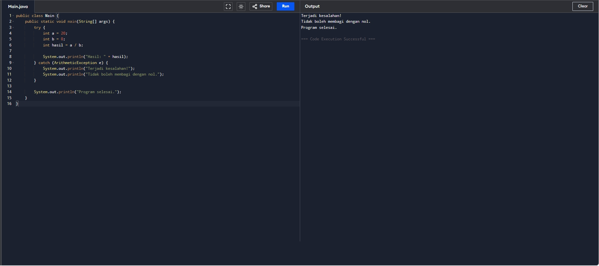

# Tugas Pemrograman Berorientasi Objek

| | |
| :--- | :--- |
| **Kode Kelas** | SI403 |
| **Dosen Pengajar** | Dr. Fauziah , S.Kom., M.M.S.I. |
| **Universitas** | Universitas Siber Asia |
| **Nama Mahasiswa** | Angga Alfiansah |
| **NIM** | 240101010032 |


---
# Analisis Kode Program Java - Latihan Sesi 11 (Exception Handling)

Dokumen ini berisi analisis baris demi baris serta penjelasan maksud dan tujuan untuk contoh kode Java mengenai konsep Penanganan Eksepsi (Exception Handling).

---

## Latihan 1: Penanganan Pembagian dengan Nol (Try-Catch)

### Kode Sumber

```java
public class Main {
    public static void main(String[] args) {
        try {
            int a = 20;
            int b = 0;
            int hasil = a / b;

            System.out.println("Hasil: " + hasil);
        } catch (ArithmeticException e) {
            System.out.println("Terjadi kesalahan!");
            System.out.println("Tidak boleh membagi dengan nol.");
        }

        System.out.println("Program selesai.");
    }
}
```

### Maksud dan Tujuan Kode

- **Maksud**: Program ini mendemonstrasikan penanganan kesalahan runtime (eksepsi) bertipe `ArithmeticException` menggunakan struktur blok kontrol `try-catch` ketika program melakukan operasi pembagian integer dengan nol (yang mana secara matematika dan pemrograman adalah operasi ilegal).
- **Tujuan**: Memastikan ketahanan aplikasi (_software robustness_). Dengan dibungkus menggunakan blok `try-catch`, jika terjadi kegagalan operasi matematika di tengah jalan, aplikasi tidak akan mati mendadak secara abnormal (_crash_), melainkan akan menampilkan pesan error secara ramah dan terus melanjutkan instruksi program berikutnya hingga selesai dengan selamat.

### Analisa Per Baris

- **Baris 1**: `public class Main {` — Mendeklarasikan kelas utama publik bernama `Main`.
- **Baris 2**: `public static void main(String[] args) {` — Titik masuk utama program Java (main method) saat dijalankan oleh JVM.
- **Baris 3**: `try {` — Membuka blok `try` untuk menandai area kode yang berpotensi memicu kesalahan runtime (_exception_).
- **Baris 4**: `int a = 20;` — Mendeklarasikan variabel lokal `a` bertipe `int` dan memberinya nilai awal `20`.
- **Baris 5**: `int b = 0;` — Mendeklarasikan variabel lokal `b` bertipe `int` dan memberinya nilai awal `0`.
- **Baris 6**: `int hasil = a / b;` — Melakukan operasi matematika pembagian `a / b` (20 dibagi 0). Karena dalam sistem pembagian integer komputer pembagian dengan nol tidak diperbolehkan, JVM akan melempar (_throw_) objek eksepsi bernama `ArithmeticException`. Baris program di bawahnya dalam blok `try` seketika dihentikan, dan alur kontrol langsung dialihkan ke blok `catch`.
- **Baris 8**: `System.out.println("Hasil: " + hasil);` — Perintah untuk mencetak hasil pembagian. Baris ini terlewati dan **tidak pernah dieksekusi** karena eksepsi sudah terjadi pada baris 6.
- **Baris 9**: `} catch (ArithmeticException e) {` — Menutup blok `try` dan membuka blok `catch` untuk menangkap eksepsi bertipe `ArithmeticException` (direferensikan melalui variabel `e`).
- **Baris 10**: `System.out.println("Terjadi kesalahan!");` — Perintah mencetak pemberitahuan kesalahan ke konsol saat eksepsi berhasil ditangkap.
- **Baris 11**: `System.out.println("Tidak boleh membagi dengan nol.");` — Mencetak pesan edukatif penanganan kesalahan spesifik pembagian nol.
- **Baris 12**: `}` — Penutup blok penanganan eksepsi `catch`.
- **Baris 14**: `System.out.println("Program selesai.");` — Mencetak pesan indikator bahwa program tetap berjalan normal hingga selesai. Baris ini **tetap tereksekusi dengan sukses** karena kesalahan sebelumnya telah ditangani (_handled_) dengan aman, sehingga program tidak mati paksa (_crash_).
- **Baris 15**: `}` — Penutup metode `main`.
- **Baris 16**: `}` — Penutup kelas `Main`.

### Hasil Menjalankan Program (Screenshot)




