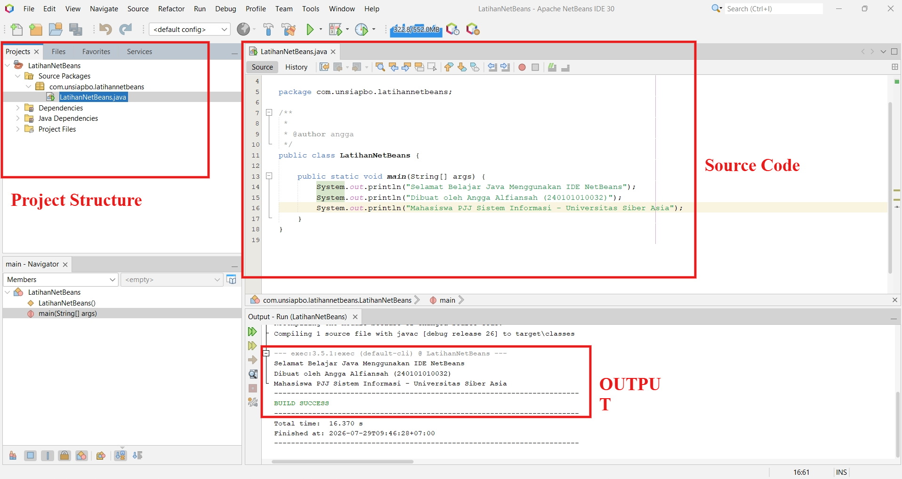
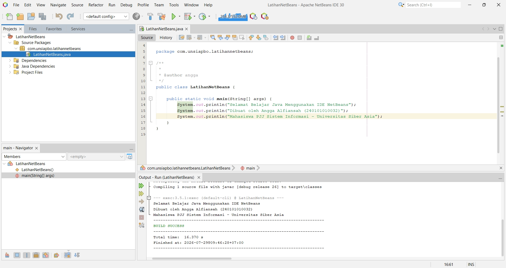

# Tugas Pemrograman Berorientasi Objek

| | |
| :--- | :--- |
| **Kode Kelas** | SI403 |
| **Dosen Pengajar** | Dr. Fauziah , S.Kom., M.M.S.I. |
| **Universitas** | Universitas Siber Asia |
| **Nama Mahasiswa** | Angga Alfiansah |
| **NIM** | 240101010032 |


---
# Analisis Kode Program Java - Latihan Sesi 12 (Peran IDE & Dasar PBO)

## Analisa Soal 1: Peran IDE NetBeans

IDE Java NetBeans berfungsi sebagai lingkungan terpadu untuk menulis, mengorganisasi, meng-compile, dan menjalankan program Java dalam satu aplikasi.

Dibandingkan dengan text editor biasa, NetBeans menyediakan fitur-fitur produktivitas seperti:

- **Syntax Highlighting**: Mempermudah identifikasi elemen kode secara visual.
- **Auto-Complete**: Mempercepat pengetikan dengan saran penulisan kode secara dinamis.
- **Refactoring**: Memudahkan restrukturisasi dan pengorganisasian kode secara aman.
- **Project Management**: Mengelola struktur direktori, kelas, dan dependensi proyek secara visual.
- **Built-in Compiler**: Memungkinkan eksekusi program tanpa harus menggunakan terminal secara manual.

Integrasi dengan debugger, version control, dan template proyek membuat proses pengembangan, pengujian, dan pemeliharaan kode menjadi lebih cepat dan meminimalisir kesalahan.

---

## Analisa Soal 2: Komponen Utama Antarmuka NetBeans

Berikut adalah peran dari masing-masing komponen utama pada IDE NetBeans:

- **Menu Bar**: Berisi menu utama seperti _File_, _Edit_, _View_, _Run_, dan _Tools_ untuk mengakses perintah pembuatan proyek baru, konfigurasi global, dan kontrol eksekusi.
- **Toolbar**: Menyediakan tombol pintas (_shortcut_) untuk aksi yang sering digunakan seperti _Run_, _Debug_, _Save_, dan _Build Project_ guna menghemat waktu.
- **Projects**: Menampilkan struktur logis proyek (_packages_, _classes_, _libraries_) agar pengelolaan kode sumber dan dependensi eksternal menjadi terstruktur.
- **Files**: Menampilkan struktur direktori fisik di komputer (bukan hanya yang terdaftar di proyek), berguna untuk memantau berkas non-kode seperti berkas konfigurasi.
- **Services**: Mengelola integrasi eksternal seperti database (JDBC), server aplikasi (GlassFish, Tomcat), dan API cloud.
- **Source Editor**: Area utama penulisan kode Java yang dilengkapi penomoran baris, deteksi error real-time, dan saran perbaikan (_hints_).
- **Navigator**: Menampilkan daftar kelas, metode, dan variabel dalam berkas aktif untuk mempermudah navigasi dalam berkas kode yang panjang.
- **Output**: Menampilkan hasil kompilasi, status build, keluaran program (`System.out.println`), serta detail error log ketika terjadi _runtime crash_.

---

## Analisa Soal 3: Alur Analisis Error secara Sistematis

Langkah-langkah terstruktur saat menemukan error saat menjalankan program Java di NetBeans:

1.  **Analisis Pesan di Tab Output**: Periksa pesan error, jenis exception, dan cari baris kode spesifik yang dilaporkan bermasalah.
2.  **Navigasi Cepat (Double-Click)**: Klik ganda pada baris error di tab Output untuk langsung mengarahkan kursor ke baris kode yang bermasalah di Source Editor.
3.  **Manfaatkan Debugger**: Pasang _breakpoint_ pada baris sebelum error, lalu jalankan mode Debug dengan navigasi _Step Over_ / _Step Into_ untuk memeriksa nilai variabel di memori.
4.  **Validasi Struktur Paket**: Cek penamaan kelas dan direktori di Navigator dan Projects untuk memastikan deklarasi `package` sudah sesuai.
5.  **Periksa Konfigurasi Proyek**: Jika error berkaitan dengan pustaka (_libraries_) yang tidak ditemukan, buka _Project Properties_ untuk memverifikasi JDK dan dependensi proyek.

---

## Analisa Soal 4: Perbandingan IDE NetBeans, Eclipse, dan IntelliJ IDEA

- **NetBeans**:
  - _Kelebihan_: Sangat ramah pemula, langsung siap pakai tanpa konfigurasi awal yang rumit, dan memiliki GUI Builder Swing yang andal.
  - _Kekurangan_: Pilihan plugin dan dukungan fitur modern/lanjutan lebih terbatas dibandingkan kompetitornya.
- **Eclipse**:
  - _Kelebihan_: Sangat fleksibel dan memiliki ekosistem plugin yang sangat besar dan matang.
  - _Kekurangan_: Pengaturan awal terasa lebih kompleks dan antarmukanya relatif padat.
- **IntelliJ IDEA**:
  - _Kelebihan_: Memberikan analisis kode paling cerdas, navigasi termudah, dan fitur auto-complete yang paling responsif di kelasnya.
  - _Kekurangan_: Versi terlengkap (Ultimate) berbayar, dan membutuhkan konsumsi memori (RAM) yang lebih besar.

**Kesimpulan**: Untuk pemula yang baru belajar Java dasar, NetBeans adalah pilihan yang praktis karena kemudahan penggunaannya. Namun, untuk skala industri atau proyek besar, IntelliJ IDEA dan Eclipse merupakan standar industri yang lebih dominan.

---

## Soal 5: Praktik Program (Proyek LatihanNetBeans)

### Deskripsi Proyek

Proyek baru dibuat pada IDE NetBeans dengan nama **LatihanNetBeans** di bawah _package_ `com.unsiapbo.latihannetbeans`. Program ini menampilkan identitas mahasiswa (Nama, NIM, Program Studi, Fakultas) serta kalimat _"Selamat Belajar Java Menggunakan IDE NetBeans"_.

### Kode Sumber (LatihanNetBeans.java)

```java
package com.unsiapbo.latihannetbeans;

/**
 * @author angga
 */
public class LatihanNetBeans {

    public static void main(String[] args) {
        System.out.println("Selamat Belajar Java Menggunakan IDE NetBeans");
        System.out.println("Dibuat oleh Angga Alfiansah (240101010032)");
        System.out.println("Mahasiswa PJJ Sistem Informasi - Universitas Siber Asia");
    }
}
```

### Bukti Pengerjaan (Screenshots)

Berikut adalah bukti pengerjaan berupa tampilan _Project Structure_, _Source Code_, dan _Output Program_ pada IDE NetBeans:

#### Tampilan Beranotasi (Annotated Screenshot)



#### Tampilan Bersih (Clean Screenshot)




