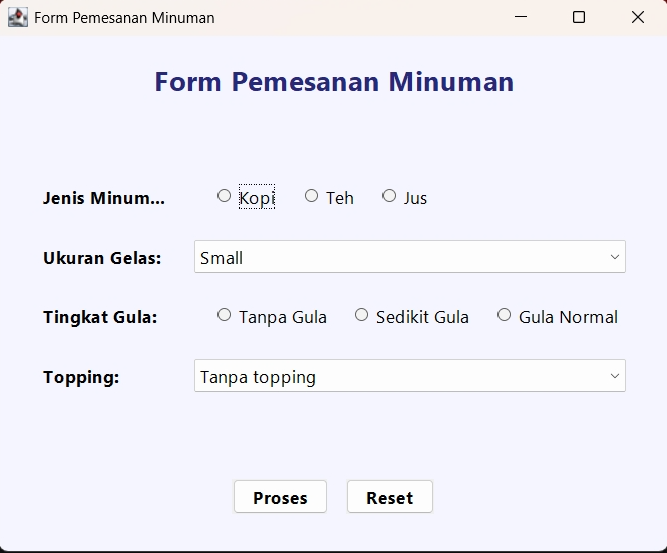
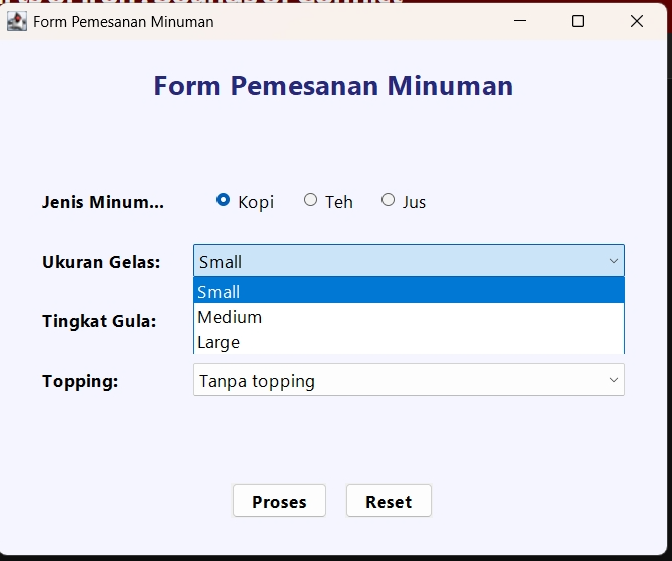
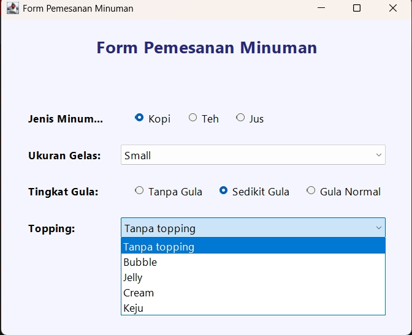
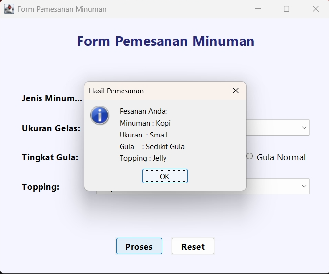
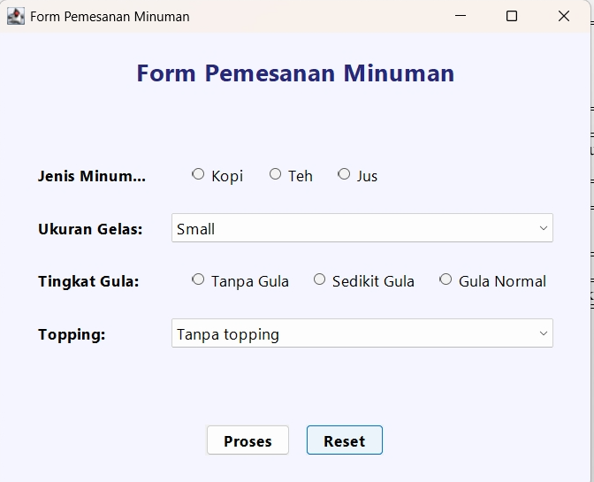

# Tugas Pemrograman Berorientasi Objek

| | |
| :--- | :--- |
| **Kode Kelas** | SI403 |
| **Dosen Pengajar** | Dr. Fauziah , S.Kom., M.M.S.I. |
| **Universitas** | Universitas Siber Asia |
| **Nama Mahasiswa** | Angga Alfiansah |
| **NIM** | 240101010032 |


---
# Analisis Kode Program Java - Latihan Sesi 13 (GUI Swing)
**Implementasi Radio Button dan Combo Box Menggunakan Java Swing**

## 1. Tujuan Praktikum
- Memahami penggunaan komponen `JRadioButton`, `ButtonGroup`, `JComboBox`, dan `JOptionPane` dalam Java Swing.
- Mampu mengelompokkan `JRadioButton` menggunakan `ButtonGroup` sehingga hanya satu pilihan yang dapat dipilih.
- Mampu mengambil nilai dari komponen antarmuka pengguna (GUI) dan menampilkannya sebagai *output* menggunakan dialog pesan (`JOptionPane`).
- Mampu merancang form antarmuka grafis (GUI) yang interaktif, menarik, dan fungsional.

## 2. Langkah Kerja
1. Membuat *project* baru di Java dan menyiapkan kelas `PemesananMinuman` yang mewarisi `JFrame`.
2. Menginisialisasi komponen-komponen UI, antara lain:
   - `JLabel` untuk judul aplikasi dan label masing-masing kategori form.
   - `JRadioButton` untuk pilihan **Jenis Minuman** (Kopi, Teh, Jus) dan **Tingkat Gula** (Tanpa Gula, Sedikit Gula, Gula Normal).
   - `ButtonGroup` untuk mengelompokkan radio button agar sifat pemilihannya *mutually exclusive* (hanya bisa memilih satu).
   - `JComboBox` untuk pilihan **Ukuran Gelas** dan **Topping**.
   - `JButton` untuk aksi ("Proses", "Reset").
3. Mengatur *layout* dengan perpaduan `BorderLayout`, `GridBagLayout`, dan `FlowLayout` serta merapikan form dengan menambahkan padding/batas visual.
4. Menerapkan *System Look and Feel* (`UIManager`) untuk memberikan tampilan form yang rapi, bersih, dan modern sesuai dengan tampilan bawaan sistem operasi.
5. Menambahkan `ActionListener` pada tombol untuk menangkap klik pengguna dan memproses masukan yang diberikan (baik memunculkan *message dialog* maupun me-reset form ke kondisi semula).

## 3. Hasil Praktikum

### 3.1 Tampilan Awal Program


### 3.2 Tampilan Saat Mengisi Form



### 3.3 Tampilan Hasil Tombol Proses


### 3.4 Tampilan Form Setelah Direset


### 3.5 Source Code (`PemesananMinuman.java`)

```java
package latihan13;

import javax.swing.*;
import javax.swing.border.EmptyBorder;
import java.awt.*;

public class PemesananMinuman extends JFrame {

    private JLabel lblJudul;

    // Minuman
    private JRadioButton rbKopi;
    private JRadioButton rbTeh;
    private JRadioButton rbJus;
    private ButtonGroup bgMinuman;

    // Ukuran
    private JComboBox<String> cbUkuran;

    // Tingkat gula
    private JRadioButton rbTanpaGula;
    private JRadioButton rbSedikitGula;
    private JRadioButton rbGulaNormal;
    private ButtonGroup bgGula;

    // Topping
    private JComboBox<String> cbTopping;

    // Tombol
    private JButton btnProses;
    private JButton btnReset;

    public PemesananMinuman() {
        setTitle("Form Pemesanan Minuman");
        setDefaultCloseOperation(JFrame.EXIT_ON_CLOSE);
        setSize(550, 450);
        setLocationRelativeTo(null);

        // Main panel with padding
        JPanel mainPanel = new JPanel(new BorderLayout(10, 10));
        mainPanel.setBorder(new EmptyBorder(20, 25, 20, 25));
        mainPanel.setBackground(new Color(245, 245, 255));

        // Judul
        lblJudul = new JLabel("Form Pemesanan Minuman", SwingConstants.CENTER);
        lblJudul.setFont(new Font("Segoe UI", Font.BOLD, 22));
        lblJudul.setForeground(new Color(40, 40, 120));
        lblJudul.setBorder(new EmptyBorder(0, 0, 20, 0));
        mainPanel.add(lblJudul, BorderLayout.NORTH);

        // Panel form
        JPanel formPanel = new JPanel(new GridBagLayout());
        formPanel.setBackground(new Color(245, 245, 255));
        GridBagConstraints gbc = new GridBagConstraints();
        gbc.insets = new Insets(10, 10, 10, 10);
        gbc.anchor = GridBagConstraints.WEST;
        gbc.fill = GridBagConstraints.HORIZONTAL;
        gbc.weightx = 1.0;

        Font labelFont = new Font("Segoe UI", Font.BOLD, 14);
        Font controlFont = new Font("Segoe UI", Font.PLAIN, 14);

        // Jenis minuman
        JLabel lblMinuman = new JLabel("Jenis Minuman:");
        lblMinuman.setFont(labelFont);
        gbc.gridx = 0;
        gbc.gridy = 0;
        gbc.weightx = 0.3;
        formPanel.add(lblMinuman, gbc);

        rbKopi = new JRadioButton("Kopi");
        rbTeh = new JRadioButton("Teh");
        rbJus = new JRadioButton("Jus");
        bgMinuman = new ButtonGroup();
        bgMinuman.add(rbKopi);
        bgMinuman.add(rbTeh);
        bgMinuman.add(rbJus);

        JPanel pnlMinuman = new JPanel(new FlowLayout(FlowLayout.LEFT, 15, 0));
        pnlMinuman.setBackground(new Color(245, 245, 255));
        rbKopi.setFont(controlFont);
        rbKopi.setBackground(new Color(245, 245, 255));
        rbTeh.setFont(controlFont);
        rbTeh.setBackground(new Color(245, 245, 255));
        rbJus.setFont(controlFont);
        rbJus.setBackground(new Color(245, 245, 255));
        pnlMinuman.add(rbKopi);
        pnlMinuman.add(rbTeh);
        pnlMinuman.add(rbJus);

        gbc.gridx = 1;
        gbc.weightx = 0.7;
        formPanel.add(pnlMinuman, gbc);

        // Ukuran
        JLabel lblUkuran = new JLabel("Ukuran Gelas:");
        lblUkuran.setFont(labelFont);
        gbc.gridx = 0;
        gbc.gridy = 1;
        gbc.weightx = 0.3;
        formPanel.add(lblUkuran, gbc);

        cbUkuran = new JComboBox<>(new String[] { "Small", "Medium", "Large" });
        cbUkuran.setFont(controlFont);
        gbc.gridx = 1;
        gbc.weightx = 0.7;
        formPanel.add(cbUkuran, gbc);

        // Tingkat gula
        JLabel lblGula = new JLabel("Tingkat Gula:");
        lblGula.setFont(labelFont);
        gbc.gridx = 0;
        gbc.gridy = 2;
        gbc.weightx = 0.3;
        formPanel.add(lblGula, gbc);

        rbTanpaGula = new JRadioButton("Tanpa Gula");
        rbSedikitGula = new JRadioButton("Sedikit Gula");
        rbGulaNormal = new JRadioButton("Gula Normal");
        bgGula = new ButtonGroup();
        bgGula.add(rbTanpaGula);
        bgGula.add(rbSedikitGula);
        bgGula.add(rbGulaNormal);

        JPanel pnlGula = new JPanel(new FlowLayout(FlowLayout.LEFT, 15, 0));
        pnlGula.setBackground(new Color(245, 245, 255));
        rbTanpaGula.setFont(controlFont);
        rbTanpaGula.setBackground(new Color(245, 245, 255));
        rbSedikitGula.setFont(controlFont);
        rbSedikitGula.setBackground(new Color(245, 245, 255));
        rbGulaNormal.setFont(controlFont);
        rbGulaNormal.setBackground(new Color(245, 245, 255));
        pnlGula.add(rbTanpaGula);
        pnlGula.add(rbSedikitGula);
        pnlGula.add(rbGulaNormal);

        gbc.gridx = 1;
        gbc.weightx = 0.7;
        formPanel.add(pnlGula, gbc);

        // Topping
        JLabel lblTopping = new JLabel("Topping:");
        lblTopping.setFont(labelFont);
        gbc.gridx = 0;
        gbc.gridy = 3;
        gbc.weightx = 0.3;
        formPanel.add(lblTopping, gbc);

        cbTopping = new JComboBox<>(new String[] { "Tanpa topping", "Bubble", "Jelly", "Cream", "Keju" });
        cbTopping.setFont(controlFont);
        gbc.gridx = 1;
        gbc.weightx = 0.7;
        formPanel.add(cbTopping, gbc);

        mainPanel.add(formPanel, BorderLayout.CENTER);

        // Tombol
        JPanel buttonPanel = new JPanel(new FlowLayout(FlowLayout.CENTER, 15, 10));
        buttonPanel.setBackground(new Color(245, 245, 255));
        buttonPanel.setBorder(new EmptyBorder(15, 0, 0, 0));

        btnProses = new JButton("Proses");
        btnProses.setFont(labelFont);
        btnProses.setFocusPainted(false);

        btnReset = new JButton("Reset");
        btnReset.setFont(labelFont);
        btnReset.setFocusPainted(false);

        buttonPanel.add(btnProses);
        buttonPanel.add(btnReset);

        mainPanel.add(buttonPanel, BorderLayout.SOUTH);

        // Action listeners
        btnProses.addActionListener(e -> prosesPesanan());
        btnReset.addActionListener(e -> resetForm());

        add(mainPanel);
    }

    private String getMinuman() {
        if (rbKopi.isSelected())
            return "Kopi";
        if (rbTeh.isSelected())
            return "Teh";
        if (rbJus.isSelected())
            return "Jus";
        return null;
    }

    private String getGula() {
        if (rbTanpaGula.isSelected())
            return "Tanpa Gula";
        if (rbSedikitGula.isSelected())
            return "Sedikit Gula";
        if (rbGulaNormal.isSelected())
            return "Gula Normal";
        return null;
    }

    private void prosesPesanan() {
        String minuman = getMinuman();
        String ukuran = (String) cbUkuran.getSelectedItem();
        String gula = getGula();
        String topping = (String) cbTopping.getSelectedItem();

        if (minuman == null) {
            JOptionPane.showMessageDialog(this,
                    "Silakan pilih jenis minuman!",
                    "Peringatan",
                    JOptionPane.WARNING_MESSAGE);
            return;
        }

        if (gula == null) {
            JOptionPane.showMessageDialog(this,
                    "Silakan pilih tingkat gula!",
                    "Peringatan",
                    JOptionPane.WARNING_MESSAGE);
            return;
        }

        String pesan = "Pesanan Anda:\n"
                + "Minuman : " + minuman + "\n"
                + "Ukuran  : " + ukuran + "\n"
                + "Gula    : " + gula + "\n"
                + "Topping : " + topping;

        JOptionPane.showMessageDialog(this, pesan,
                "Hasil Pemesanan",
                JOptionPane.INFORMATION_MESSAGE);
    }

    private void resetForm() {
        bgMinuman.clearSelection();
        bgGula.clearSelection();
        cbUkuran.setSelectedIndex(0);
        cbTopping.setSelectedIndex(0);
    }

    public static void main(String[] args) {
        try {
            UIManager.setLookAndFeel(UIManager.getSystemLookAndFeelClassName());
        } catch (Exception e) {
            e.printStackTrace();
        }
        SwingUtilities.invokeLater(() -> {
            new PemesananMinuman().setVisible(true);
        });
    }
}
```

## 4. Jawaban Pertanyaan Analisis

**1. Jelaskan fungsi ButtonGroup pada komponen Radio Button!**
Fungsi `ButtonGroup` adalah untuk mengelompokkan beberapa objek `JRadioButton` menjadi satu kesatuan logis di mana hanya **satu tombol yang bisa dipilih pada satu waktu** (*mutually exclusive*). Ketika pengguna memilih salah satu *radio button* dalam grup tersebut, pilihan sebelumnya secara otomatis akan dibatalkan/dihapus (*unselected*).

**2. Mengapa Radio Button lebih tepat digunakan dibandingkan Check Box pada kasus pemilihan jenis minuman?**
Pada pemilihan jenis minuman, pengguna umumnya hanya diperbolehkan memilih **satu jenis minuman saja** untuk satu pesanan (misalnya, tidak bisa memesan "Kopi" dan "Jus" sekaligus tercampur dalam satu gelas). *Radio Button* mewakili logika "pilihan tunggal wajib", sedangkan *Check Box* digunakan untuk kasus "banyak pilihan diperbolehkan" atau "tidak memilih sama sekali diperbolehkan".

**3. Apa fungsi JComboBox pada aplikasi yang telah dibuat?**
Fungsi `JComboBox` dalam aplikasi ini adalah menyediakan pilihan berupa daftar tarik-turun (*dropdown list*) yang sangat hemat ruang tampilan. Pengguna dapat mengklik elemen ini untuk melihat semua daftar pilihan lalu menyeleksi salah satunya (digunakan pada input Ukuran Gelas dan Topping).

**4. Apa yang terjadi apabila Radio Button tidak dimasukkan ke dalam ButtonGroup?**
Apabila `JRadioButton` tidak dimasukkan ke dalam `ButtonGroup`, masing-masing tombol akan bekerja dan berdiri sendiri, sifatnya akan berubah menjadi seperti *check box*. Akibatnya, pengguna dapat **memilih semua *radio button* secara bersamaan** (contoh: bisa memilih Kopi, Teh, dan Jus sekaligus secara bersamaan), yang mana menyebabkan alur logika program salah total.

**5. Bagaimana cara mengambil nilai yang dipilih pada JComboBox menggunakan Java?**
Nilai dari `JComboBox` dapat diambil dengan memanggil metode `.getSelectedItem()`. Karena kembalian nilai aslinya adalah objek generik, maka kita perlu mengkonversi atau meng-*cast* nilainya menjadi tipe data `String`. 
Contoh pengkodean:
```java
String ukuran = (String) cbUkuran.getSelectedItem();
```

**6. Apa fungsi tombol Reset pada aplikasi berbasis form?**
Fungsi tombol "Reset" adalah untuk mengosongkan kembali isi form, membatalkan semua seleksi/pilihan dari pengguna sebelumnya, dan mengembalikan semua keadaan komponen form ke **kondisi awal (*default*)** agar antarmuka form siap digunakan untuk pemasukan data atau pesanan baru tanpa harus menutup dan membuka ulang aplikasi.

**7. Jelaskan perbedaan penggunaan Radio Button dan Combo Box dalam antarmuka pengguna (GUI)!**
- **Radio Button**: Menampilkan semua opsi pilihan secara serentak ke layar secara langsung sehingga mudah dipindai oleh mata pengguna tanpa harus mengeklik (*one-click action*). Sangat tepat untuk kelompok pilihan yang opsinya tidak terlalu banyak (berkisar antara 2 sampai 4 opsi).
- **Combo Box**: Hanya menampilkan opsi yang sedang terpilih, sementara opsi yang lain tersembunyi di daftar *dropdown*. Sangat tepat untuk opsi pilihan yang jumlahnya banyak (lebih dari 4 hingga puluhan, seperti memilh negara, tanggal) untuk sangat menghemat tempat pada tampilan layar.

## 5. Kesimpulan
Berdasarkan praktikum sesi ini, dapat disimpulkan bahwa bahasa pemrograman Java dengan *library* GUI Swing memberikan fasilitas yang lengkap untuk pembuatan aplikasi antarmuka pengguna berbasis formulir (*form based*). Penggunaan komponen yang tepat untuk suatu input amatlah penting (seperti kapan harus memakai *Radio Button* versus *Combo Box*, serta pengaplikasian *ButtonGroup*). Dengan menangkap input, memvalidasinya, dan merespons balik memakai dialog informasi interaktif seperti `JOptionPane`, kita telah menguasai alur kerja fundamental bagaimana sebuah interaksi aplikasi sisi-klien diciptakan.


