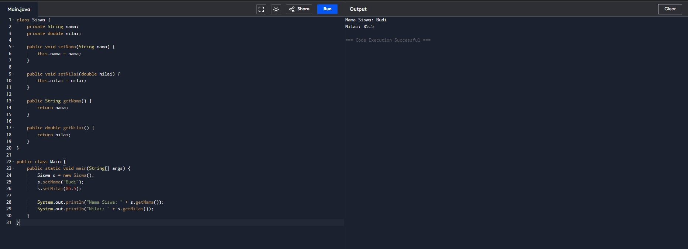
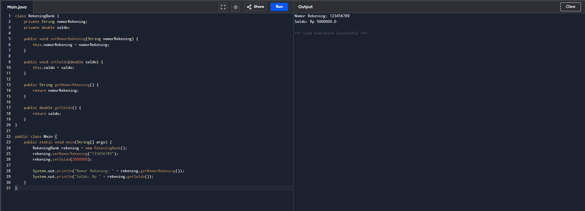
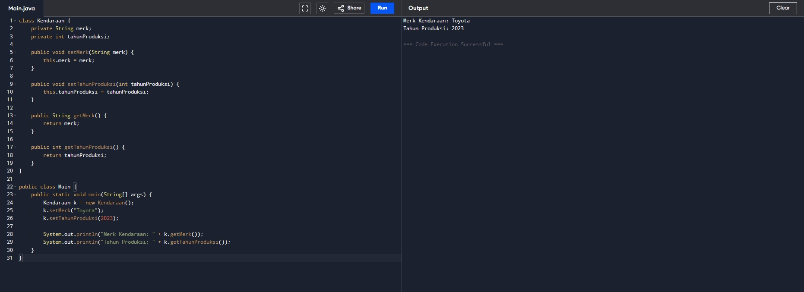
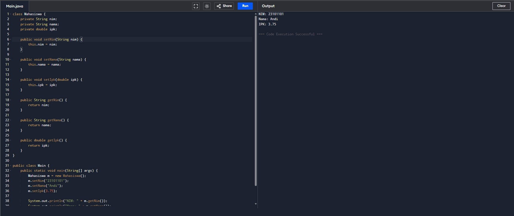

# Tugas Pemrograman Berorientasi Objek

| | |
| :--- | :--- |
| **Kode Kelas** | SI403 |
| **Dosen Pengajar** | Dr. Fauziah , S.Kom., M.M.S.I. |
| **Universitas** | Universitas Siber Asia |
| **Nama Mahasiswa** | Angga Alfiansah |
| **NIM** | 240101010032 |


---
# Analisis Kode Program Java - Latihan Sesi 9 (Enkapsulasi)

Dokumen ini berisi analisis baris demi baris serta penjelasan maksud dan tujuan untuk contoh kode Java mengenai konsep Enkapsulasi (Encapsulation).

---

## Latihan 1: Kelas Siswa

### Kode Sumber
```java
class Siswa {
    private String nama;
    private double nilai;

    public void setNama(String nama) {
        this.nama = nama;
    }

    public void setNilai(double nilai) {
        this.nilai = nilai;
    }

    public String getNama() {
        return nama;
    }

    public double getNilai() {
        return nilai;
    }
}

public class Main {
    public static void main(String[] args) {
        Siswa s = new Siswa();
        s.setNama("Budi");
        s.setNilai(85.5);

        System.out.println("Nama Siswa: " + s.getNama());
        System.out.println("Nilai: " + s.getNilai());
    }
}
```

### Maksud dan Tujuan Kode
* **Maksud**: Kode ini merepresentasikan objek `Siswa` yang memiliki data pribadi berupa `nama` dan `nilai`. Data-data ini dilindungi dengan access modifier `private` (enkapsulasi).
* **Tujuan**: Melindungi variabel instansi `nama` dan `nilai` agar tidak dapat dimodifikasi atau dibaca secara sembarangan dari luar kelas. Akses pengisian data dialihkan melalui metode setter (`setNama`, `setNilai`) dan akses pembacaan data dialihkan melalui metode getter (`getNama`, `getNilai`). Dengan begitu, jika ingin menambahkan aturan validasi (misalnya nilai tidak boleh negatif atau lebih dari 100), kita dapat menambahkannya di dalam metode setter tanpa merusak kode luar.

### Analisa Per Baris
* **Baris 1**: `class Siswa {` — Mendeklarasikan kelas dengan nama `Siswa` menggunakan hak akses default (package-private).
* **Baris 2**: `private String nama;` — Mendeklarasikan variabel instansi `nama` bertipe `String` dengan access modifier `private` agar tidak dapat diakses secara langsung dari luar kelas.
* **Baris 3**: `private double nilai;` — Mendeklarasikan variabel instansi `nilai` bertipe `double` dengan access modifier `private`.
* **Baris 5**: `public void setNama(String nama) {` — Mendeklarasikan metode setter bertipe `void` dengan akses `public` untuk mengisi nilai atribut `nama`.
* **Baris 6**: `this.nama = nama;` — Menggunakan kata kunci `this` untuk merujuk pada variabel instansi objek saat ini guna membedakannya dari variabel parameter metode dengan nama yang sama.
* **Baris 7**: `}` — Penutup blok metode `setNama`.
* **Baris 9**: `public void setNilai(double nilai) {` — Mendeklarasikan metode setter bertipe `void` dengan akses `public` untuk mengisi nilai atribut `nilai`.
* **Baris 10**: `this.nilai = nilai;` — Mengisi variabel instansi objek `nilai` dengan nilai dari parameter metode.
* **Baris 11**: `}` — Penutup blok metode `setNilai`.
* **Baris 13**: `public String getNama() {` — Mendeklarasikan metode getter bertipe `String` dengan akses `public` untuk membaca nilai atribut `nama`.
* **Baris 14**: `return nama;` — Mengembalikan nilai dari variabel instansi `nama`.
* **Baris 15**: `}` — Penutup blok metode `getNama`.
* **Baris 17**: `public double getNilai() {` — Mendeklarasikan metode getter bertipe `double` dengan akses `public` untuk membaca nilai atribut `nilai`.
* **Baris 18**: `return nilai;` — Mengembalikan nilai dari variabel instansi `nilai`.
* **Baris 19**: `}` — Penutup blok metode `getNilai`.
* **Baris 20**: `}` — Penutup dari kelas `Siswa`.
* **Baris 22**: `public class Main {` — Mendeklarasikan kelas utama publik bernama `Main`.
* **Baris 23**: `public static void main(String[] args) {` — Titik masuk utama program Java (main method) saat dijalankan.
* **Baris 24**: `Siswa s = new Siswa();` — Membuat instansi objek baru dari kelas `Siswa` dan menyimpannya di variabel referensi `s`.
* **Baris 25**: `s.setNama("Budi");` — Memanggil metode `setNama` pada objek `s` untuk mengatur nama menjadi `"Budi"`.
* **Baris 26**: `s.setNilai(85.5);` — Memanggil metode `setNilai` pada objek `s` untuk mengatur nilai menjadi `85.5`.
* **Baris 28**: `System.out.println("Nama Siswa: " + s.getNama());` — Mengambil data nama menggunakan getter `getNama()` lalu mencetaknya ke konsol.
* **Baris 29**: `System.out.println("Nilai: " + s.getNilai());` — Mengambil data nilai menggunakan getter `getNilai()` lalu mencetaknya ke konsol.
* **Baris 30**: `}` — Penutup blok metode `main`.
* **Baris 31**: `}` — Penutup kelas `Main`.

### Hasil Menjalankan Program (Screenshot)




---

## Latihan 2: Kelas RekeningBank

### Kode Sumber
```java
class RekeningBank {
    private String nomorRekening;
    private double saldo;

    public void setNomorRekening(String nomorRekening) {
        this.nomorRekening = nomorRekening;
    }

    public void setSaldo(double saldo) {
        this.saldo = saldo;
    }

    public String getNomorRekening() {
        return nomorRekening;
    }

    public double getSaldo() {
        return saldo;
    }
}

public class Main {
    public static void main(String[] args) {
        RekeningBank rekening = new RekeningBank();
        rekening.setNomorRekening("123456789");
        rekening.setSaldo(5000000);

        System.out.println("Nomor Rekening: " + rekening.getNomorRekening());
        System.out.println("Saldo: Rp " + rekening.getSaldo());
    }
}
```

### Maksud dan Tujuan Kode
* **Maksud**: Program ini merancang kelas `RekeningBank` untuk menyimpan informasi penting berupa `nomorRekening` dan `saldo` nasabah secara aman menggunakan hak akses `private`.
* **Tujuan**: Menghindari modifikasi tidak sah dari luar kelas terhadap data penting seperti saldo (misal: penulisan langsung `rekening.saldo = -1000` dari kelas `Main` yang bisa mengacaukan sistem perbankan). Segala bentuk perubahan saldo diwajibkan melalui metode setter `setSaldo` untuk memvalidasi transaksi secara legal, sedangkan informasi rekening dibaca secara aman melalui metode getter.

### Analisa Per Baris
* **Baris 1**: `class RekeningBank {` — Mendeklarasikan kelas dengan nama `RekeningBank`.
* **Baris 2**: `private String nomorRekening;` — Mendeklarasikan atribut `nomorRekening` bertipe `String` dengan hak akses `private` (enkapsulasi).
* **Baris 3**: `private double saldo;` — Mendeklarasikan atribut `saldo` bertipe `double` dengan hak akses `private`.
* **Baris 5**: `public void setNomorRekening(String nomorRekening) {` — Mendeklarasikan metode setter bertipe `void` untuk menyimpan nomor rekening.
* **Baris 6**: `this.nomorRekening = nomorRekening;` — Mengisi variabel instansi objek `nomorRekening` dengan nilai parameter.
* **Baris 7**: `}` — Penutup blok metode `setNomorRekening`.
* **Baris 9**: `public void setSaldo(double saldo) {` — Mendeklarasikan metode setter bertipe `void` untuk mengatur nilai saldo.
* **Baris 10**: `this.saldo = saldo;` — Mengisi variabel instansi objek `saldo` dengan nilai parameter.
* **Baris 11**: `}` — Penutup blok metode `setSaldo`.
* **Baris 13**: `public String getNomorRekening() {` — Mendeklarasikan metode getter bertipe `String` untuk mengambil nomor rekening.
* **Baris 14**: `return nomorRekening;` — Mengembalikan nilai dari variabel instansi `nomorRekening`.
* **Baris 15**: `}` — Penutup blok metode `getNomorRekening`.
* **Baris 17**: `public double getSaldo() {` — Mendeklarasikan metode getter bertipe `double` untuk mengambil nilai saldo.
* **Baris 18**: `return saldo;` — Mengembalikan nilai dari variabel instansi `saldo`.
* **Baris 19**: `}` — Penutup blok metode `getSaldo`.
* **Baris 20**: `}` — Penutup kelas `RekeningBank`.
* **Baris 22**: `public class Main {` — Mendeklarasikan kelas utama bernama `Main`.
* **Baris 23**: `public static void main(String[] args) {` — Titik masuk utama program Java.
* **Baris 24**: `RekeningBank rekening = new RekeningBank();` — Membuat instansi objek baru dari kelas `RekeningBank` ke variabel `rekening`.
* **Baris 25**: `rekening.setNomorRekening("123456789");` — Mengatur nomor rekening menjadi `"123456789"` melalui metode setter.
* **Baris 26**: `rekening.setSaldo(5000000);` — Mengatur saldo menjadi `5000000` melalui metode setter.
* **Baris 28**: `System.out.println("Nomor Rekening: " + rekening.getNomorRekening());` — Membaca data nomor rekening menggunakan getter `getNomorRekening()` lalu mencetaknya ke konsol.
* **Baris 29**: `System.out.println("Saldo: Rp " + rekening.getSaldo());` — Membaca data saldo menggunakan getter `getSaldo()` lalu mencetaknya ke konsol.
* **Baris 30**: `}` — Penutup blok metode `main`.
* **Baris 31**: `}` — Penutup kelas `Main`.

### Hasil Menjalankan Program (Screenshot)




---

## Latihan 3: Kelas Kendaraan

### Kode Sumber
```java
class Kendaraan {
    private String merk;
    private int tahunProduksi;

    public void setMerk(String merk) {
        this.merk = merk;
    }

    public void setTahunProduksi(int tahunProduksi) {
        this.tahunProduksi = tahunProduksi;
    }

    public String getMerk() {
        return merk;
    }

    public int getTahunProduksi() {
        return tahunProduksi;
    }
}

public class Main {
    public static void main(String[] args) {
        Kendaraan k = new Kendaraan();
        k.setMerk("Toyota");
        k.setTahunProduksi(2023);

        System.out.println("Merk Kendaraan: " + k.getMerk());
        System.out.println("Tahun Produksi: " + k.getTahunProduksi());
    }
}
```

### Maksud dan Tujuan Kode
* **Maksud**: Kode ini digunakan untuk merepresentasikan karakteristik dasar `Kendaraan` berupa `merk` dan `tahunProduksi` dengan prinsip enkapsulasi.
* **Tujuan**: Mencegah kesalahan entri data di dalam program. Atribut diatur `private` sehingga modifikasi data harus melalui setter. Di masa depan, setter `setTahunProduksi` dapat diberi filter logika agar tahun yang dimasukkan tidak boleh lebih dari tahun berjalan atau di bawah tahun tertentu (misal sebelum 1800), memastikan konsistensi dan integritas data objek.

### Analisa Per Baris
* **Baris 1**: `class Kendaraan {` — Mendeklarasikan kelas dengan nama `Kendaraan`.
* **Baris 2**: `private String merk;` — Mendeklarasikan atribut `merk` bertipe `String` dengan hak akses `private` (enkapsulasi).
* **Baris 3**: `private int tahunProduksi;` — Mendeklarasikan atribut `tahunProduksi` bertipe `int` dengan hak akses `private`.
* **Baris 5**: `public void setMerk(String merk) {` — Mendeklarasikan metode setter bertipe `void` untuk mengisi merk kendaraan.
* **Baris 6**: `this.merk = merk;` — Mengisi variabel instansi objek `merk` dengan nilai parameter.
* **Baris 7**: `}` — Penutup blok metode `setMerk`.
* **Baris 9**: `public void setTahunProduksi(int tahunProduksi) {` — Mendeklarasikan metode setter bertipe `void` untuk mengatur tahun produksi.
* **Baris 10**: `this.tahunProduksi = tahunProduksi;` — Mengisi variabel instansi objek `tahunProduksi` dengan nilai parameter.
* **Baris 11**: `}` — Penutup blok metode `setTahunProduksi`.
* **Baris 13**: `public String getMerk() {` — Mendeklarasikan metode getter bertipe `String` untuk membaca data merk.
* **Baris 14**: `return merk;` — Mengembalikan nilai dari variabel instansi `merk`.
* **Baris 15**: `}` — Penutup blok metode `getMerk`.
* **Baris 17**: `public int getTahunProduksi() {` — Mendeklarasikan metode getter bertipe `int` untuk mengambil tahun produksi.
* **Baris 18**: `return tahunProduksi;` — Mengembalikan nilai dari variabel instansi `tahunProduksi`.
* **Baris 19**: `}` — Penutup blok metode `getTahunProduksi`.
* **Baris 20**: `}` — Penutup kelas `Kendaraan`.
* **Baris 22**: `public class Main {` — Mendeklarasikan kelas utama bernama `Main`.
* **Baris 23**: `public static void main(String[] args) {` — Titik masuk utama program Java.
* **Baris 24**: `Kendaraan k = new Kendaraan();` — Membuat instansi objek baru dari kelas `Kendaraan` ke variabel `k`.
* **Baris 25**: `k.setMerk("Toyota");` — Mengisi merk kendaraan dengan `"Toyota"` menggunakan setter.
* **Baris 26**: `k.setTahunProduksi(2023);` — Mengisi tahun produksi dengan `2023` menggunakan setter.
* **Baris 28**: `System.out.println("Merk Kendaraan: " + k.getMerk());` — Mengambil data merk via getter dan mencetaknya.
* **Baris 29**: `System.out.println("Tahun Produksi: " + k.getTahunProduksi());` — Mengambil data tahun produksi via getter dan mencetaknya.
* **Baris 30**: `}` — Penutup blok metode `main`.
* **Baris 31**: `}` — Penutup kelas `Main`.

### Hasil Menjalankan Program (Screenshot)




---

## Latihan 4: Kelas Mahasiswa

### Kode Sumber
```java
class Mahasiswa {
    private String nim;
    private String nama;
    private double ipk;

    public void setNim(String nim) {
        this.nim = nim;
    }

    public void setNama(String nama) {
        this.nama = nama;
    }

    public void setIpk(double ipk) {
        this.ipk = ipk;
    }

    public String getNim() {
        return nim;
    }

    public String getNama() {
        return nama;
    }

    public double getIpk() {
        return ipk;
    }
}

public class Main {
    public static void main(String[] args) {
        Mahasiswa m = new Mahasiswa();
        m.setNim("23101101");
        m.setNama("Andi");
        m.setIpk(3.75);

        System.out.println("NIM: " + m.getNim());
        System.out.println("Nama: " + m.getNama());
        System.out.println("IPK: " + m.getIpk());
    }
}
```

### Maksud dan Tujuan Kode
* **Maksud**: Kode ini membuat kelas `Mahasiswa` untuk menyimpan informasi profil akademik (`nim`, `nama`, `ipk`) secara terenkapsulasi.
* **Tujuan**: Mencegah manipulasi data akademik mahasiswa secara ilegal dari luar kelas (misalnya mengganti IPK secara sepihak tanpa melewati sistem kelulusan). Dengan enkapsulasi, akses ke data sensitif diwajibkan melalui getter-setter yang terkontrol, menjaga validitas data di dalam sistem database mahasiswa.

### Analisa Per Baris
* **Baris 1**: `class Mahasiswa {` — Mendeklarasikan kelas dengan nama `Mahasiswa`.
* **Baris 2**: `private String nim;` — Mendeklarasikan atribut `nim` bertipe `String` dengan akses `private` (enkapsulasi).
* **Baris 3**: `private String nama;` — Mendeklarasikan atribut `nama` bertipe `String` dengan akses `private`.
* **Baris 4**: `private double ipk;` — Mendeklarasikan atribut `ipk` bertipe `double` dengan akses `private`.
* **Baris 6**: `public void setNim(String nim) {` — Mendeklarasikan metode setter bertipe `void` untuk menyimpan data NIM.
* **Baris 7**: `this.nim = nim;` — Mengisi variabel instansi objek `nim` dengan nilai parameter.
* **Baris 8**: `}` — Penutup blok metode `setNim`.
* **Baris 10**: `public void setNama(String nama) {` — Mendeklarasikan metode setter bertipe `void` untuk menyimpan nama.
* **Baris 11**: `this.nama = nama;` — Mengisi variabel instansi objek `nama` dengan nilai parameter.
* **Baris 12**: `}` — Penutup blok metode `setNama`.
* **Baris 14**: `public void setIpk(double ipk) {` — Mendeklarasikan metode setter bertipe `void` untuk menyimpan IPK.
* **Baris 15**: `this.ipk = ipk;` — Mengisi variabel instansi objek `ipk` dengan nilai parameter.
* **Baris 16**: `}` — Penutup blok metode `setIpk`.
* **Baris 18**: `public String getNim() {` — Mendeklarasikan metode getter bertipe `String` untuk membaca data NIM.
* **Baris 19**: `return nim;` — Mengembalikan nilai dari variabel instansi `nim`.
* **Baris 20**: `}` — Penutup blok metode `getNim`.
* **Baris 22**: `public String getNama() {` — Mendeklarasikan metode getter bertipe `String` untuk membaca nama.
* **Baris 23**: `return nama;` — Mengembalikan nilai dari variabel instansi `nama`.
* **Baris 24**: `}` — Penutup blok metode `getNama`.
* **Baris 26**: `public double getIpk() {` — Mendeklarasikan metode getter bertipe `double` untuk membaca IPK.
* **Baris 27**: `return ipk;` — Mengembalikan nilai dari variabel instansi `ipk`.
* **Baris 28**: `}` Penutup blok metode `getIpk`.
* **Baris 29**: `}` — Penutup kelas `Mahasiswa`.
* **Baris 31**: `public class Main {` — Mendeklarasikan kelas utama bernama `Main`.
* **Baris 32**: `public static void main(String[] args) {` — Titik masuk utama program Java.
* **Baris 33**: `Mahasiswa m = new Mahasiswa();` — Membuat instansi objek baru dari kelas `Mahasiswa` ke variabel `m`.
* **Baris 34**: `m.setNim("23101101");` — Mengatur NIM objek `m` menjadi `"23101101"` via setter.
* **Baris 35**: `m.setNama("Andi");` — Mengatur nama objek `m` menjadi `"Andi"` via setter.
* **Baris 36**: `m.setIpk(3.75);` — Mengatur IPK objek `m` menjadi `3.75` via setter.
* **Baris 38**: `System.out.println("NIM: " + m.getNim());` — Mengambil data NIM via getter dan mencetaknya.
* **Baris 39**: `System.out.println("Nama: " + m.getNama());` — Mengambil data nama via getter dan mencetaknya.
* **Baris 40**: `System.out.println("IPK: " + m.getIpk());` — Mengambil data IPK via getter dan mencetaknya.
* **Baris 41**: `}` — Penutup blok metode `main`.
* **Baris 42**: `}` — Penutup kelas `Main`.

### Hasil Menjalankan Program (Screenshot)




